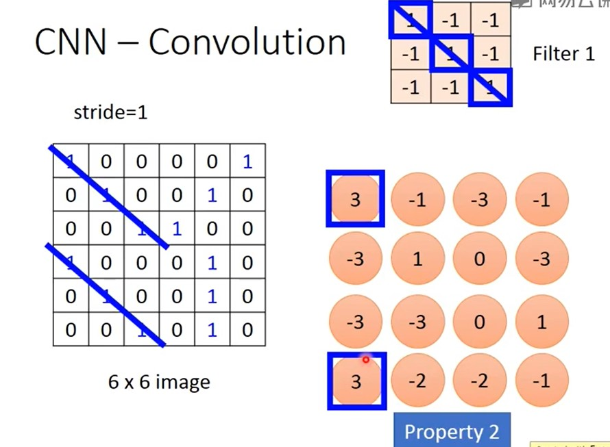

# Coonvolutional Neuron Network - 卷积神经网络

用同一个pattern(1,1,1)来检测图像中哪里有相同的pattern, 因为检测pattern不需要扫描整张图片，所以只用过滤器就可以了。 

Filter里面的点的值实际上就是weights. 如图，这个neuron只对input 1， 2， 3， 7， 8， 9， 13， 14， 15做计算，所以他舍弃了一些input. 不是全连接. 

Shared Wights

### Max Pooling:
把前面计算得到的matrix(4\*4)以2\*2为单位分割，然后将每一个子矩阵中的最大值保留下来。 
把原来6\*6的image变成 2\*2的image。
每个filter就代表一个channel. 

CNN in Keras:
input format (Vector -> 3-D tensor)

model2.add(Convolution2D(25, 3, 3, input_shape=（1， 28， 28）))

25个3\*3 filters，
- 1： black/white
- 3:  RGB

model2.add(MaxPolling2D((2, 2)))

model2.add(Flatten())

Deep Neural Networks are easily fooled!
youtube

[A neural Algorithm of Artistic Style](https://arxiv.org/abs/1508.06576)

Go: 看棋盘的一小部分就可以知道是否叫吃。 Go中的1st layer filter是5\*5. 
同样的pattern可以出现在不同的位置。

Go can  use Max Pooling? - not use max-pooling: Alpha go paper

Go中的每个位置都用48个value描述 - 加上domain knowledge. 

