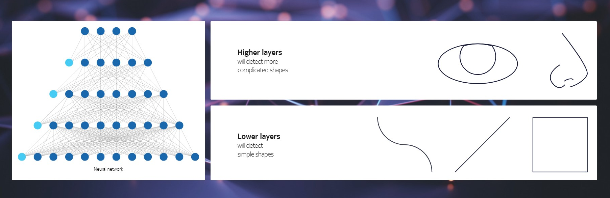
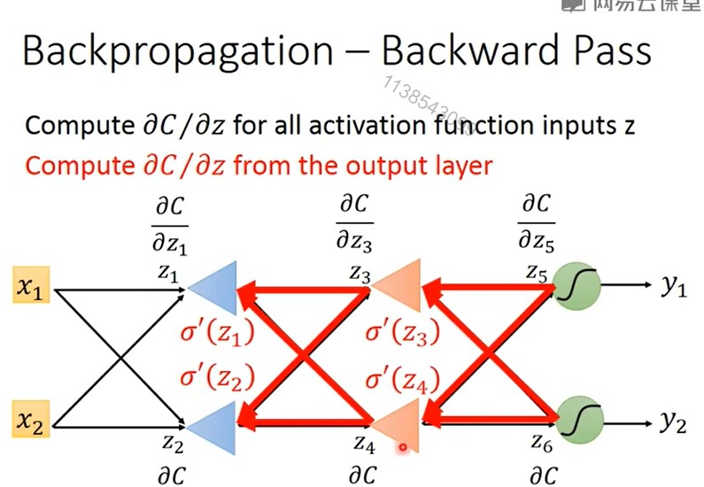

# 深度学习by Li Hongyi


在计算梯度时实际上是建立了一个反向network，从后往前算，是反向传导。用2种链式法则求偏微分. - Chain Rule 




Tensorflow & Theano 是一个微分器， 非常flexible。Keras是interface of Tensorflow or Theano。

Francois Chollet - author of the Keras, works for Google.

Keras - horn in Greek - 牛角

### 使用Keras写hello world

决定network的形状
```python
Dense - fully connected layer
model.add(Dense(input_dim = 28*28), output_dim=500))
model.add(Activation('sigmoid'))

model.add(Dense(output_dim = 500), output_dim=500))
model.add(Activation('sigmoid'))

model.add(Dense(output_dim = 10), output_dim=500))
model.add(Activation('softmax'))
```

### Evaluate function goodness
```python
model.compile(loss='categorical_entropy', 
optimizer='adam', metrics=['accuracy'])
```
machine自己决定learning rate。

### Find the optimal network parameters
```python
modle.fit(X_train, y_train, batch_size=100, nb_epoch=20) # 把样本随机的分成很多分，每份100个样本， 把所有的样本看过一遍叫一个epoch. 

score = model.evaluate(x_test, y_test)
print('Total loss on Testing Set', score[0])
```


